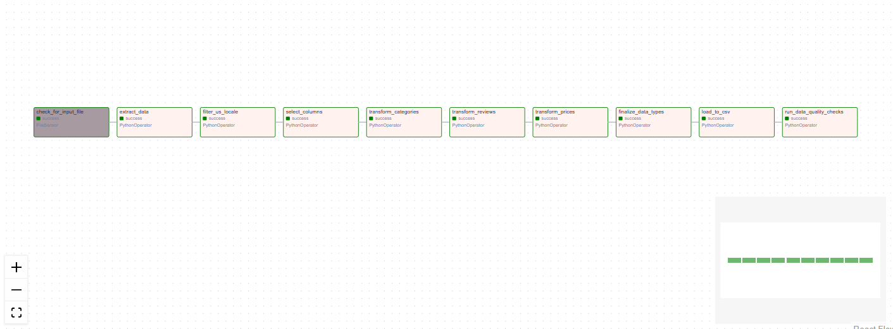

# Amazon Ecommerce Apache Airflow ETL
The current implementation performs transformations to raw data in Apache Airflow via the creation of temporary datasets between transformations.
There multiples ways to do it:
- Cross communications XComs (small data scenario due to size and serialization limitations)
- S3 buckets (for big data scenario for example)
- temporary files (for medium size data)

In order to run Apache Airflow ETL and see DAG execution perform the following steps:
* Right click on dockerfile and select "Build Image..."
* Wait for completion
* Right click on docker-compose.yml and select "Compose Up"
* Wait for completion
* Open Apache Airflow in specified link
* Run DAG

# DAG

